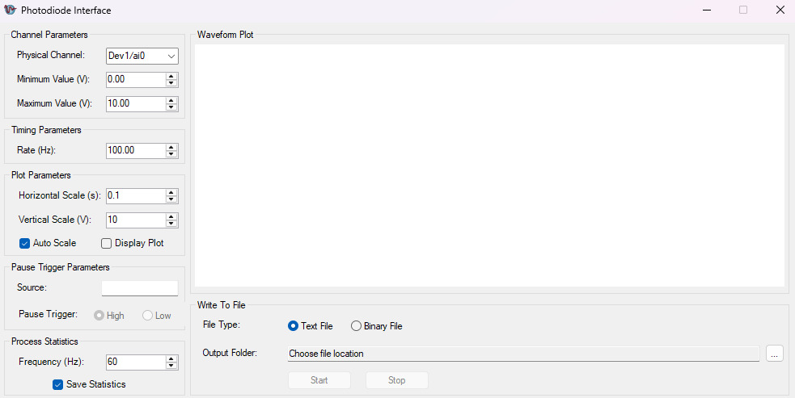

# Photodiode Interface

A lightweight Windows desktop application for high-speed analog voltage acquisition using National Instruments DAQ hardware through the NI-DAQmx .NET API.

Designed for photodiode monitoring and general analog signal acquisition, the application provides real-time waveform visualization, configurable data logging, optional digital pause triggering, and live process statistics generation.



---

## Features

### Real-Time Analog Acquisition

Acquire continuous analog voltage data directly from supported National Instruments DAQ devices.

Configurable acquisition parameters:

- Physical input channel selection  
- Sampling rate configuration  
- Minimum and maximum input voltage range  

Supported for continuous analog input streaming using NI-DAQmx.

---

### Live Waveform Plotting

Display incoming analog voltage data in real time during acquisition.

Plot controls include:

- Adjustable horizontal time scale  
- Adjustable vertical voltage scale  
- Automatic Y-axis scaling  
- Rolling waveform history buffer  
- Plotting independent of file recording  

The plot continuously scrolls with new incoming data while maintaining a configurable history buffer, allowing time window adjustments without immediately discarding older samples.

---

### Data Recording

Record acquired voltage data directly to disk while streaming.

Two output formats are supported.

#### Text File (`acquisitionData.txt`)

Human-readable tab-delimited voltage values.

Example:

```text
Dev1/ai0
0.014532
0.013998
0.015101
0.014887
```

Useful for:

- Quick inspection  
- Spreadsheet import  
- MATLAB or Python processing  

---

#### Binary File (`acquisitionData.bin`)

Raw double-precision binary storage for high-speed acquisition and reduced overhead.

Binary structure:

```text
[Channel Header]
[Double Sample 1]
[Double Sample 2]
[Double Sample 3]
...
```

Useful for:

- High-frequency acquisition  
- Long-duration recording  
- Reduced disk overhead  

---

### Process Statistics Logging

The application can continuously calculate process statistics during acquisition and save them to a CSV file.

Computed metrics:

- Mean Voltage  
- Minimum Voltage  
- Maximum Voltage  
- RMS Voltage  
- Absolute Timestamp  
- Elapsed Acquisition Time  

Statistics are calculated at a user-defined frequency independent of acquisition rate.

Example output:

```csv
Timestamp,ElapsedSeconds,MeanVoltage,MinVoltage,MaxVoltage,RMSVoltage
45827.5023412198,0.500000,2.345221,2.103882,2.564112,2.356887
45827.5190078865,1.000000,2.351887,2.098441,2.571223,2.361001
```

The statistics scheduler maintains sample-accurate timing even when the statistics frequency does not evenly divide the acquisition rate.

---

### Pause Trigger Support

Supports hardware-level digital pause triggering through NI-DAQmx.

Trigger options:

- Pause when signal is HIGH  
- Pause when signal is LOW  

Configurable settings:

- Trigger source  
- Trigger polarity  

This allows acquisition to be synchronized with external process signals.

---

### Session-Based File Organization

Each recording session automatically creates a timestamped output directory.

Example:

```text
OutputFolder/
└── Photodiode_2026-0622_142530/
    ├── acquisitionData.txt
    ├── acquisitionData.bin
    └── processStatistics.csv
```

This prevents overwriting previous acquisition sessions and keeps recordings organized.

---

## Interface Overview

The application is divided into several control sections.

| Section | Function |
|----------|----------|
| Channel Parameters | Select DAQ analog input channel and voltage range |
| Timing Parameters | Configure acquisition sampling rate |
| Plot Parameters | Configure waveform visualization |
| Pause Trigger Parameters | Configure digital trigger gating |
| Process Statistics | Enable statistical logging and set update frequency |
| Write To File | Select output directory and output format |

---

## Typical Workflow

### 1. Configure Channel Parameters

Select:

- Physical analog input channel  
- Minimum voltage range  
- Maximum voltage range  

Example:

```text
Channel: Dev1/ai0
Min: 0 V
Max: 10 V
```

---

### 2. Configure Acquisition Rate

Set sampling frequency.

Example:

```text
100 Hz
```

---

### 3. Configure Plot Settings (Optional)

Adjust display settings.

Options:

- Horizontal scale (seconds)  
- Vertical scale (volts)  
- Auto scaling  
- Enable/disable live plotting  

---

### 4. Configure Statistics Logging (Optional)

Enable:

```text
Save Statistics
```

Set update frequency.

Example:

```text
60 Hz
```

---

### 5. Configure Output Settings

Choose file format:

- Text File  
- Binary File  

Select output folder.

---

### 6. Start Acquisition

Press:

```text
Start
```

The application will:

- Begin continuous acquisition  
- Display live waveform (if enabled)  
- Save waveform data to disk  
- Generate process statistics CSV  

---

## File Outputs

A typical recording session produces:

```text
session_folder/
├── acquisitionData.txt      # Raw waveform data (text mode)
├── acquisitionData.bin      # Raw waveform data (binary mode)
└── processStatistics.csv    # Process statistics
```

---

## Requirements

Software:

- Windows  
- .NET Framework  
- NI-DAQmx drivers installed  

Hardware:

- National Instruments DAQ device with analog input capability  

Required libraries:

- NationalInstruments.DAQmx.dll  

NI Driver Download:

https://www.ni.com/en/support/downloads/drivers/download.ni-daq-mx.html

---